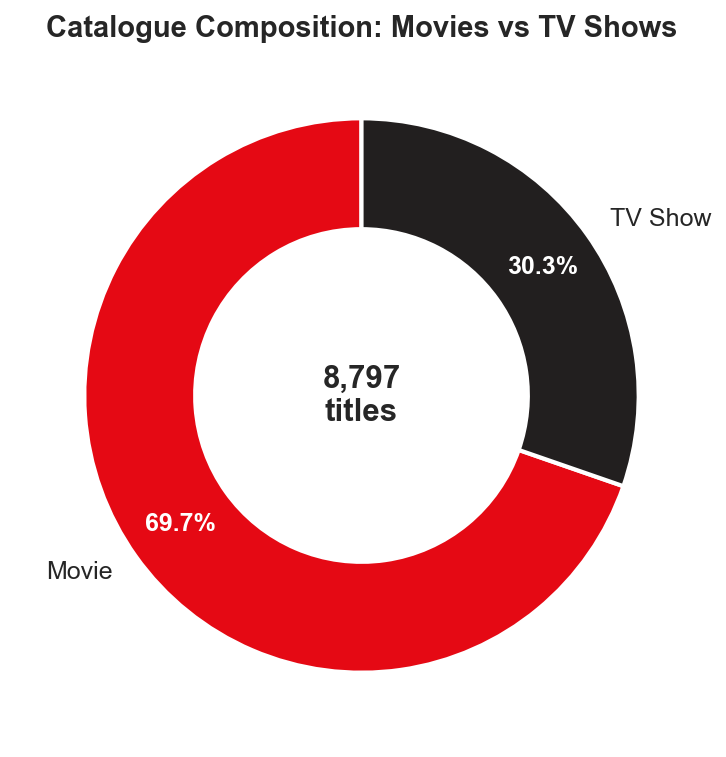
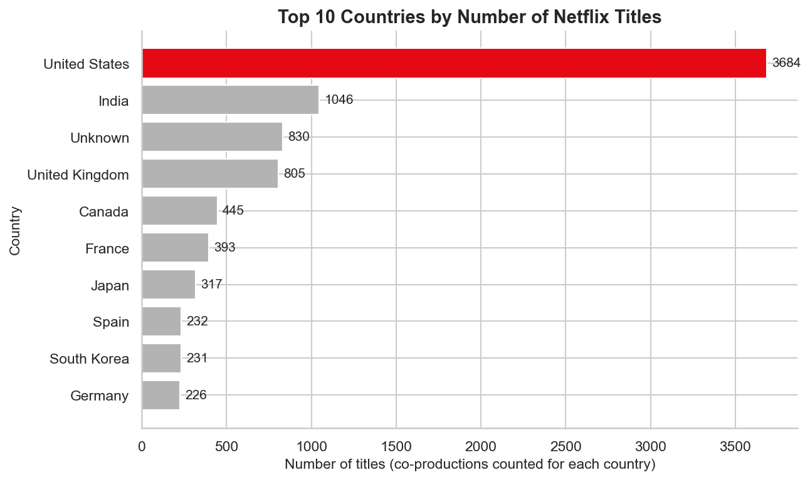
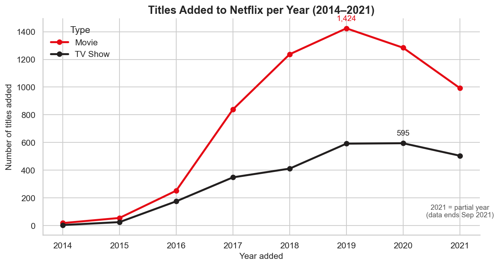
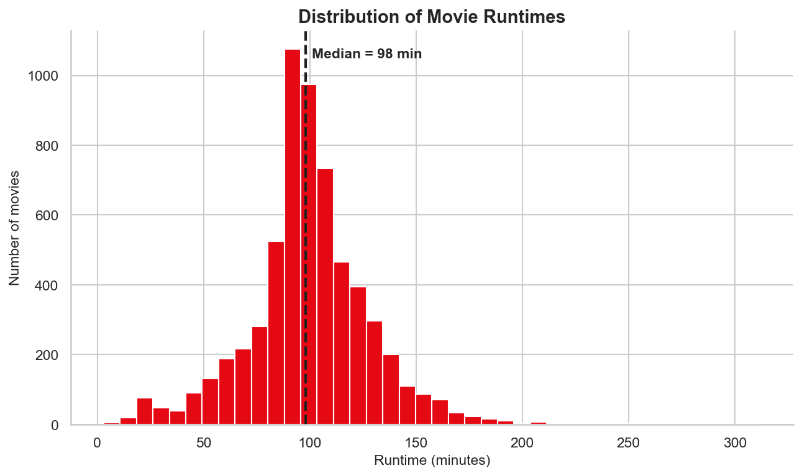
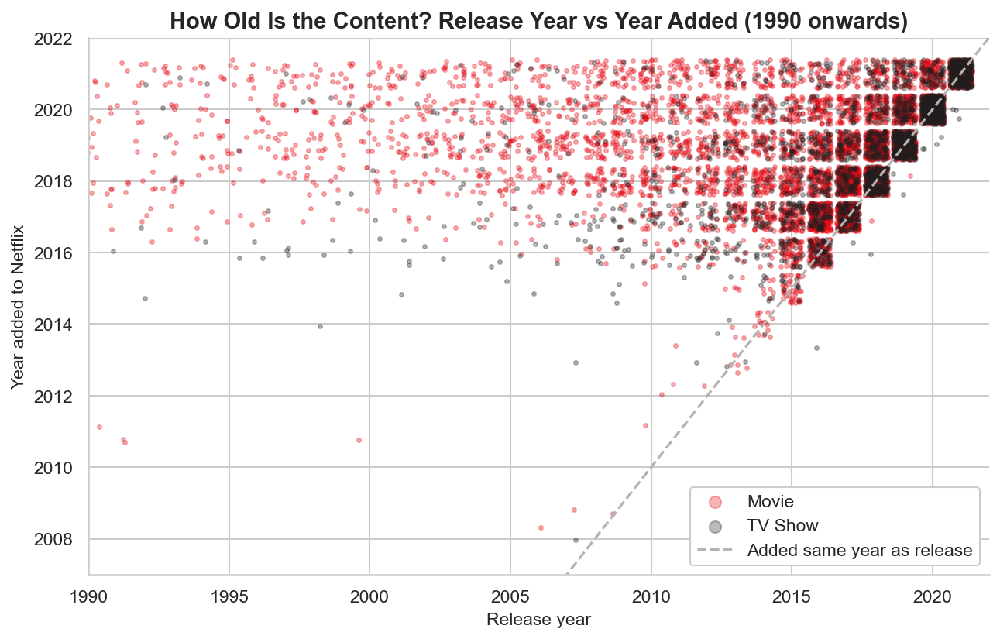
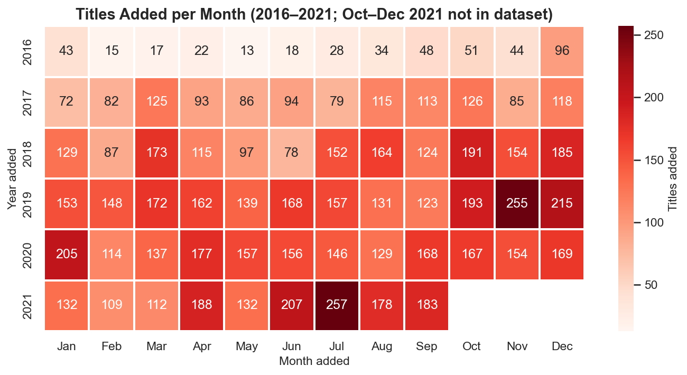
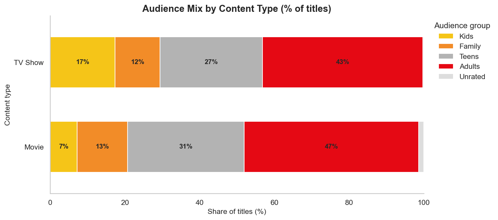

# 🎬 Netflix Movies & TV Shows — Exploratory Data Analysis

An end-to-end data analysis project in **Python (Pandas, Matplotlib, Seaborn)**. Acting as a data analyst, I load, clean and explore the Netflix catalogue dataset, visualise the key patterns, and turn the findings into **5 data-backed business insights**.

📓 **Main deliverable:** [`Netflix_EDA.ipynb`](Netflix_EDA.ipynb) (fully executed, all outputs and charts included)

## Dataset
- **Source:** [Netflix Movies and TV Shows](https://www.kaggle.com/datasets/shivamb/netflix-shows) on Kaggle (`netflix_titles.csv`)
- **Size:** 8,807 titles × 12 columns (6,131 movies, 2,676 TV shows), added to Netflix 2008 to Sep 2021

## Project Workflow
| Step | What was done |
|---|---|
| 1. Load & Inspect | Shape, dtypes, missing values, duplicates, data-quality probe, 5-line summary |
| 2. Clean | Fixed 3 misaligned rows, handled missing values, converted types, dropped irrelevant columns, engineered features. **Every decision is logged with its reason** |
| 3. EDA | 5 business questions answered with `groupby`, `value_counts`, `describe`, `crosstab` |
| 4. Visualize | 7 charts: pie, bar, line, histogram, scatter, heatmap, stacked bar |
| 5. Insights | 5 numbered insights, each tied to a chart or finding, with a recommendation |

## Key Charts
| | |
|---|---|
|  |  |
|  |  |
|  |  |



## 🔎 Key Insights
1. **Movie-heavy catalogue:** 69.7% Movies vs 30.3% TV Shows, so there is room to invest in series, which drive retention.
2. **Growth has plateaued:** additions peaked at 2,016 titles in 2019, fell 6.8% in 2020, and 2021's run-rate is level with 2019. December is the busiest month, February the quietest.
3. **US and India dominate supply:** the US is in ~42% of titles and India ~12%. India is 92% movies, while Japan and South Korea are TV-led, which points to an opportunity for Indian series.
4. **Mature skew:** ~46% of titles are Adult-rated, while Kids content is 17.4% of TV Shows but only 7.2% of Movies, so family films are under-served.
5. **Fresh but short-lived content:** 63% of titles arrive within 2 years of release, 82% of TV Shows are from 2015 or later, and 67% of shows have only one season.

## How to Run
```bash
git clone https://github.com/VishalTheTechie/netflix-eda-project.git
cd netflix-eda-project
pip install -r requirements.txt
jupyter notebook Project-1.ipynb
```

## Repository Structure
```
netflix-eda-project/
├── Project-1.ipynb      # full analysis (executed)
├── data/netflix_titles.csv
├── images/                # exported charts
├── requirements.txt
└── README.md
```

## Limitations
The data is a snapshot to Sept 2021 (2021 is incomplete), measures catalogue supply rather than viewership, and `director` is missing for ~30% of titles.

## Tech Stack
Python · Pandas · NumPy · Matplotlib · Seaborn · Jupyter
